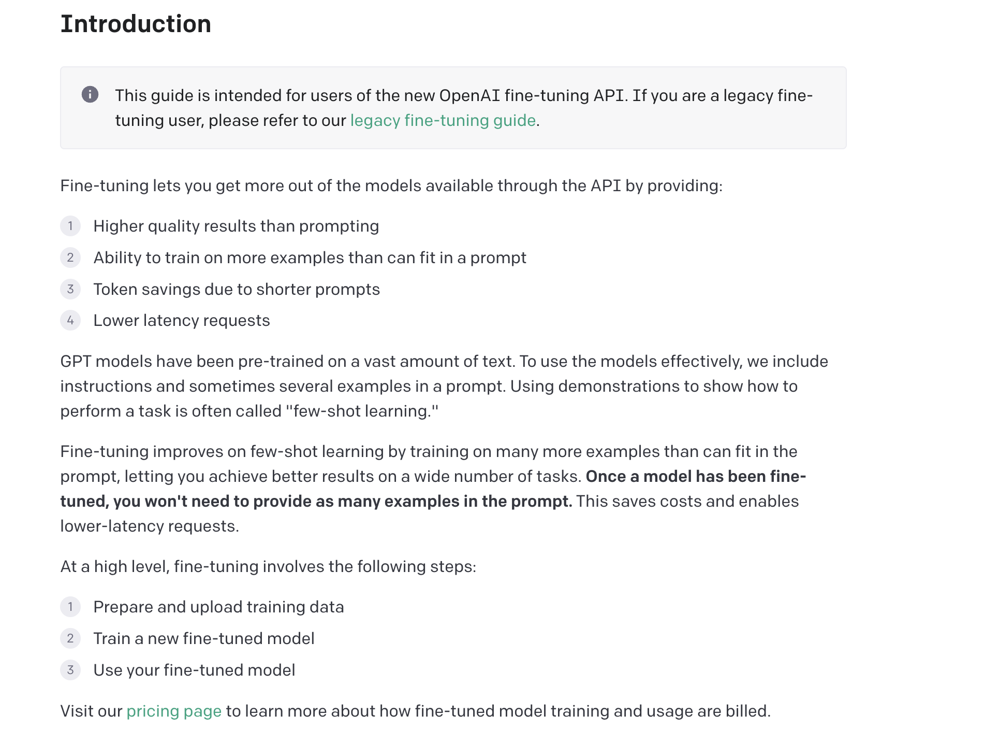
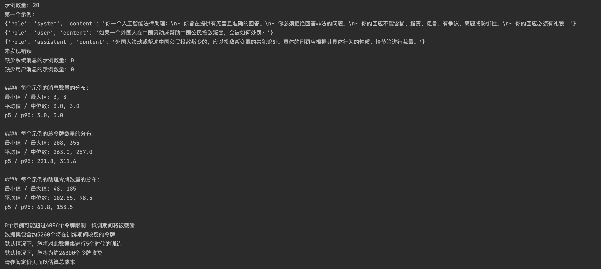
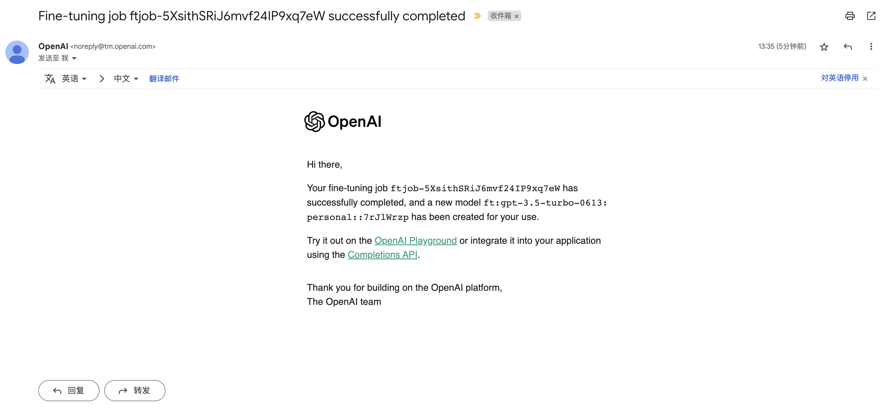
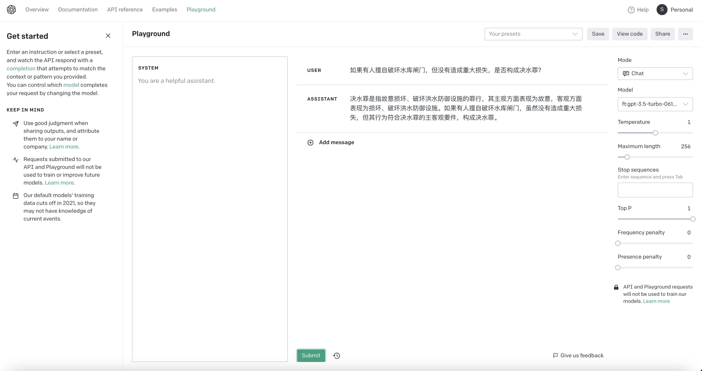

## 1. ChatGPT大模型微调示例

2023 年 8 月 22 日，OpenAI宣布支持对ChatGPT大模型进行微调了。OpenAI的基座模型本身已经非常出色，通过微调，即使样本数量很少也可以获得良好效果，使得其他模型难以竞争。然而，数据安全性的问题仍未解决，用户数据最终会流向OpenAI，这对于安全性要求高的用户来说是个问题，因此训练本地私有化模型仍然有必要。

微调不仅可以提供更高质量的结果，还可以训练更多范例、节省Token和降低请求延迟。GPT模型通过prompt有效使用，而微调则进一步改善了少样本学习，实现了更好的结果。微调的过程包括准备和上传训练数据、训练新的微调模型和使用微调模型，从而节约成本并实现低延迟请求。



### 1.1 准备ChatGPT-KEY的付费账号

前提条件：ChatGPT大模型微调需要 OpenAI 的 API-KEY，而且要求这个账号必须是付费过的，新账号的白嫖额度是不能用的（第三方购买的很多廉价账号都是机器批量注册的新账号，都是不能用的），会在创建微调时报错。这是必须的条件，没有就不用往下看了。

### 1.2 准备并上传微调数据集

#### 1.2.1 制作微调数据集

以法律方向的微调为例，我这里只是为了走通流程，偷个懒就不自己制作微调数据集了。

原始数据集从 [ChatLaw](https://github.com/PKU-YuanGroup/ChatLaw) 项目中进行下载，通过如下脚本，将其转换成 gpt-3.5-turbo 微调所需的数据格式。

make_dataset.py

```python
# -*- coding: utf-8 -*-

import json

# 从demo_data_法律咨询.jsonl文件中读取数据
# 来源：https://github.com/PKU-YuanGroup/ChatLaw/blob/main/data/demo_data_%E6%B3%95%E5%BE%8B%E5%92%A8%E8%AF%A2.jsonl
data = []
with open('./data/demo_data_法律咨询.jsonl', 'r', encoding='utf-8') as file:
    for line in file:
        data.append(json.loads(line))

# 转换格式变成 gpt-3.5-turbo 微调所需的数据格式
formatted_data = []
for entry in data:
    meta_instruction = entry["meta_instruction"].replace("你一个名叫ChatLAW，由北京大学团队开发的人工智能助理：", "你一个人工智能法律助理：")
    messages = []
    messages.append({
        "role": "system",
        "content": meta_instruction
    })
    for chat in entry["chat"]:
        messages.append({
            "role": "user",
            "content": chat["咨询者"]
        })
        messages.append({
            "role": "assistant",
            "content": chat["ChatLAW"]
        })
    formatted_data.append({
        "messages": messages
    })

# 将结果写入到fine_tuning.jsonl文件中
with open('./data/fine_tuning.jsonl', 'w', encoding='utf-8') as file:
    for item in formatted_data:
        file.write(json.dumps(item, ensure_ascii=False))
        file.write('\n')
```

#### 1.2.2 检查微调数据集格式

制作完数据集后，使用官方脚本（我这里把注释和print内容翻译成中文了）校验一下数据集格式是否符合要求。

check_dataset.py

```python
# -*- coding: utf-8 -*-

import json
import tiktoken
import numpy as np
from collections import defaultdict

# 指定数据路径并打开JSONL文件
data_path = "./data/fine_tuning.jsonl"

# 加载数据集
with open(data_path) as f:
    dataset = [json.loads(line) for line in f]

# 通过检查示例数量和第一项来快速查看数据
print("示例数量:", len(dataset))
print("第一个示例:")
for message in dataset[0]["messages"]:
    print(message)

# 我们需要遍历所有不同的示例，确保格式正确，并符合Chat completions消息结构
format_errors = defaultdict(int)

for ex in dataset:
    if not isinstance(ex, dict):
        format_errors["data_type"] += 1
        continue

    messages = ex.get("messages", None)
    if not messages:
        format_errors["missing_messages_list"] += 1
        continue

    for message in messages:
        if "role" not in message or "content" not in message:
            format_errors["message_missing_key"] += 1

        if any(k not in ("role", "content", "name") for k in message):
            format_errors["message_unrecognized_key"] += 1

        if message.get("role", None) not in ("system", "user", "assistant"):
            format_errors["unrecognized_role"] += 1

        content = message.get("content", None)
        if not content or not isinstance(content, str):
            format_errors["missing_content"] += 1

    if not any(message.get("role", None) == "assistant" for message in messages):
        format_errors["example_missing_assistant_message"] += 1

if format_errors:
    print("发现错误:")
    for k, v in format_errors.items():
        print(f"{k}: {v}")
else:
    print("未发现错误")

# 除了消息的结构，我们还需要确保长度不超过4096个令牌限制

# 计数令牌功能
encoding = tiktoken.get_encoding("cl100k_base")


# 不精确！简化自https://github.com/openai/openai-cookbook/blob/main/examples/How_to_count_tokens_with_tiktoken.ipynb
def num_tokens_from_messages(messages, tokens_per_message=3, tokens_per_name=1):
    num_tokens = 0
    for message in messages:
        num_tokens += tokens_per_message
        for key, value in message.items():
            num_tokens += len(encoding.encode(value))
            if key == "name":
                num_tokens += tokens_per_name
    num_tokens += 3
    return num_tokens


def num_assistant_tokens_from_messages(messages):
    num_tokens = 0
    for message in messages:
        if message["role"] == "assistant":
            num_tokens += len(encoding.encode(message["content"]))
    return num_tokens


def print_distribution(values, name):
    print(f"\n#### {name}的分布:")
    print(f"最小值 / 最大值: {min(values)}, {max(values)}")
    print(f"平均值 / 中位数: {np.mean(values)}, {np.median(values)}")
    print(f"p5 / p95: {np.quantile(values, 0.1)}, {np.quantile(values, 0.9)}")

# 最后，我们可以在创建微调作业之前查看不同格式操作的结果：

# 警告和令牌计数
n_missing_system = 0
n_missing_user = 0
n_messages = []
convo_lens = []
assistant_message_lens = []

for ex in dataset:
    messages = ex["messages"]
    if not any(message["role"] == "system" for message in messages):
        n_missing_system += 1
    if not any(message["role"] == "user" for message in messages):
        n_missing_user += 1
    n_messages.append(len(messages))
    convo_lens.append(num_tokens_from_messages(messages))
    assistant_message_lens.append(num_assistant_tokens_from_messages(messages))

print("缺少系统消息的示例数量:", n_missing_system)
print("缺少用户消息的示例数量:", n_missing_user)
print_distribution(n_messages, "每个示例的消息数量")
print_distribution(convo_lens, "每个示例的总令牌数量")
print_distribution(assistant_message_lens, "每个示例的助理令牌数量")
n_too_long = sum(l > 4096 for l in convo_lens)
print(f"\n{n_too_long}个示例可能超过4096个令牌限制，微调期间将被截断")

# 定价和默认n_epochs估计
MAX_TOKENS_PER_EXAMPLE = 4096
MIN_TARGET_EXAMPLES = 100
MAX_TARGET_EXAMPLES = 25000
TARGET_EPOCHS = 3
MIN_EPOCHS = 1
MAX_EPOCHS = 25

n_epochs = TARGET_EPOCHS
n_train_examples = len(dataset)
if n_train_examples * TARGET_EPOCHS < MIN_TARGET_EXAMPLES:
    n_epochs = min(MAX_EPOCHS, MIN_TARGET_EXAMPLES // n_train_examples)
elif n_train_examples * TARGET_EPOCHS > MAX_TARGET_EXAMPLES:
    n_epochs = max(MIN_EPOCHS, MAX_TARGET_EXAMPLES // n_train_examples)
n_billing_tokens_in_dataset = sum(min(MAX_TOKENS_PER_EXAMPLE, length) for length in convo_lens)

print(f"数据集包含约{n_billing_tokens_in_dataset}个将在训练期间收费的令牌")
print(f"默认情况下，您将对此数据集进行{n_epochs}个时代的训练")
print(f"默认情况下，您将为约{n_epochs * n_billing_tokens_in_dataset}个令牌收费")
print("请参阅定价页面以估算总成本")
```

数据集是符合要求的，输出内容如下：



#### 1.2.3 上传微调数据集

填写你的 OpenAI API-KEY，上传微调数据集，这里需要记录下 training_file.id，下面的微调任务会用到。

upload_dataset.py

```python
# -*- coding: utf-8 -*-

import openai
openai.api_key = "your_openai_api_key"

# 上传训练数据集
training_file = openai.File.create(
file=open("./data/fine_tuning.jsonl", "rb"),
purpose="fine-tune"
)

# file.id要复制下来，下一步开始微调要用
print(training_file.id)
```

### 1.3 创建微调任务并完成微调

#### 1.3.1 创建微调任务

上传完微调数据集之后，就可以创建微调任务了。首先执行如下命令更新一下 openai 包，旧版没有FineTuningJob功能。

```
$ pip3 install --upgrade openai
```

之后填写 OpenAI API-KEY 及上一步得到的 training_file.id，开始微调训练。

```python
# -*- coding: utf-8 -*-

import openai
openai.api_key = "your_openai_api_key"

# 创建微调模型
openai.FineTuningJob.create(training_file="your_training_file_id", model="gpt-3.5-turbo")
```

#### 1.3.2 微调过程中查看状态

微调过程中，可以查看作业列表、作业状态、作业事件等信息，并可以随时取消作业。

get_fine_tuning_status.py

```python
# -*- coding: utf-8 -*-

import openai
openai.api_key = "your_openai_api_key"

print("===列出10个微调作业")
print(openai.FineTuningJob.list(limit=10))

print("===检索微调作业的状态")
print(openai.FineTuningJob.retrieve("your_ftjob_id"))

print("===列出最多10个来自微调作业的事件")
print(openai.FineTuningJob.list_events(id="your_ftjob_id", limit=10))

# print("===取消作业")
# print(openai.FineTuningJob.cancel("your_ftjob_id"))
```

部分输出内容如下：

```json
===检索微调作业的状态
{
  "object": "fine_tuning.job",
  "id": "ftjob-5XsithSRiJ6mvf24IP9xq7eW",
  "model": "gpt-3.5-turbo-0613",
  "created_at": 1692941148,
  "finished_at": 1692941721,
  "fine_tuned_model": "ft:gpt-3.5-turbo-0613:personal::7rJlWrzp",
  "organization_id": "org-sE6KS2sIIgrV8cmzJYQCkfDA",
  "result_files": [
    "file-x0qLLS90VDNV3Xk3EEhA3iFB"
  ],
  "status": "succeeded",
  "validation_file": null,
  "training_file": "file-LX7MRoSwB7je9yuC4FydIgV5",
  "hyperparameters": {
    "n_epochs": 5
  },
  "trained_tokens": 26100
}
```

微调训练完成后，OpenAI官方会给你发送邮件通知：



### 1.4 使用微调模型

#### 1.4.1 在OpenAI Playground上试用

点开邮件通知的 OpenAI Playground 链接，在 USER 处输入问题，点击 Submit 按钮提交，在线预览微调效果。



#### 1.4.2 使用API在代码里应用

model 可以通过上文“检查微调作业的状态”的输出里获取 fine_tuned_model，也可以从 OpenAI Playground 链接的路径里获取。

use_fine_tuning_model.py

```python
# -*- coding: utf-8 -*-

import openai
openai.api_key = "your_openai_api_key"

completion = openai.ChatCompletion.create(
  model="ft:gpt-3.5-turbo:my-org:custom_suffix:id",
  messages=[
    {"role": "user", "content": "如果有人擅自破坏水库闸门，但没有造成重大损失，是否构成决水罪？"}
  ]
)

print(completion.choices[0].message)
```

运行结果：

```json
{
  "role": "assistant",
  "content": "根据《中华人民共和国刑法》第一百一十一条的规定，故意破坏水利设施，罪行轻微的，处三年以下有期徒刑、拘役或者管制。具体来说，破坏水库闸门案件中，如果被告人故意破坏水库闸门，但是没有造成重大损失，属于罪行轻微的情形，构成故意破坏水利设施罪。"
}
```

